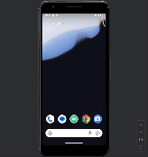

# Midterm app
Dynamic Android Mobile application that functions as a High Score Tracker for guessing number

## Functionality 

The following **required** functionality is completed:
 
* [x] User Selects start or view High scores
* [x] Start Game option sends to new fragment_game
* [x] Fragment Game stores player name, guess count, and current guess data
* [x] Fragment Increment and Decrement Guess buttons dynamically change on screen
* [x] Successfful guess stores data in Room Database 
* [x] Utilize Databinding 
* [] Use Safe args to pass data between fragments
* [] retrieve data from database 

## Extensions

## Video Walkthrough

Here's a walkthrough of implemented user stories:

.

## Notes

In completing this project, I ran into two major problems which are the following: 1. Resolving conflict between layout width, layout height, and layout weight and 2. implementing the math operations to handle consecutive operation press. Assigning 'match_parent' or 'wrap_content' will take precedence and change the way layout_weight is handled. By using '0dp' for certain variables like width of the digit_0_button, I can ensure that the 2x width size is maintained by applying layout_weight = 2. If I used wrap_content instead, the layout_weight would no longer make sense and does not double the width with an assignment of layout_weight = 2. 

In order to handle consecutive operation presses, I used boolean flag variables and a current operation variable. These two pieces of code allow for consecutive operations to be pressed and ensures that previous operation will still evaluated without clicking the '='. 
Unable to implement safe args to pass data between vfragments, so therefore unable to retrieve data from databse

## License

    Copyright [2023] [Samuel Barrido]

    Licensed under the Apache License, Version 2.0 (the "License");
    you may not use this file except in compliance with the License.
    You may obtain a copy of the License at

        http://www.apache.org/licenses/LICENSE-2.0

    Unless required by applicable law or agreed to in writing, software
    distributed under the License is distributed on an "AS IS" BASIS,
    WITHOUT WARRANTIES OR CONDITIONS OF ANY KIND, either express or implied.
    See the License for the specific language governing permissions and
    limitations under the License.
